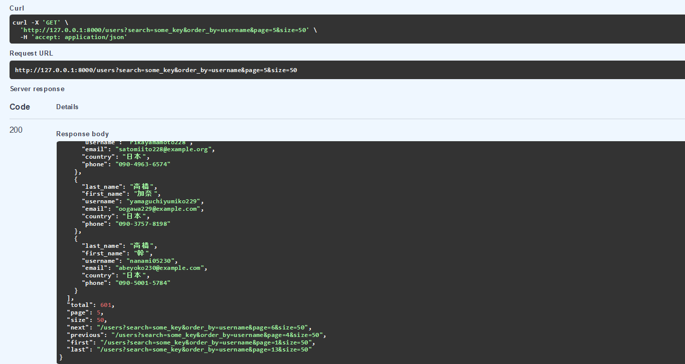

# FastAPI Pagination

[](/LICENSE)
[](https://github.com/nazmulnnb/fastapi-paginate/actions)
[](https://github.com/psf/black)
[](https://pypi.org/project/fastapi-paginate/)


fastapi-paginate is an extended work of fastapi-pagination. 
fastapi-paginate returns following extra meta information:
* next: endpoint of the next page.
* previous: endpoint of the previous page. 
* first: endpoint of the first page.
* last: endpoint of the last page.

All of these meta keeps all the filter parameters passed by the client and returns as it is.
If any of these meta is not available, it will return null.

example:


## Installation

```bash
# Basic version
pip install fastapi-paginate

# All available integrations
pip install fastapi-paginate[all]
```

Available integrations:

* [sqlalchemy](https://github.com/sqlalchemy/sqlalchemy)
* [gino](https://github.com/python-gino/gino)
* [databases](https://github.com/encode/databases)
* [ormar](http://github.com/collerek/ormar)
* [orm](https://github.com/encode/orm)
* [tortoise](https://github.com/tortoise/tortoise-orm)
* [django](https://github.com/django/django)
* [piccolo](https://github.com/piccolo-orm/piccolo)
* [sqlmodel](https://github.com/tiangolo/sqlmodel)
* [motor](https://github.com/mongodb/motor)
* [mongoengine](https://github.com/MongoEngine/mongoengine)

## Example

```python
from fastapi import FastAPI
from pydantic import BaseModel

from fastapi_paginate import Page, add_pagination, paginate

app = FastAPI()


class User(BaseModel):
    name: str
    surname: str


users = [
    User(name='Yurii', surname='Karabas'),
    # ...
]


@app.get('/users', response_model=Page[User])
async def get_users():
    return paginate(users)


add_pagination(app)
```

## sqlalchemy example
```python
from fastapi import FastAPI, Depends
from pydantic import BaseModel

from fastapi_paginate import Page, add_pagination
from fastapi_paginate.ext.sqlalchemy import paginate

from sqlalchemy.orm import Session

app = FastAPI()

class UserModel(Base):
    name = Column(String)
    surname = Column(String)
    age = Column(Integer)

class User(BaseModel):
    name: str
    surname: str
    age: int

@app.get('/users', response_model=Page[User])
async def get_users(db_session: Session = Depends(get_db_session)):
    stmt = db_session.query(UserModel)
    
    # add filters 
    stmt = stmt.filter(UserModel.age < 30)
    
    # sort
    stmt = stmt.order_by(asc(UserModel.age))
    
    return paginate(stmt)


add_pagination(app)
```


This repo is forked from [fastapi-pagination](https://github.com/uriyyo/fastapi-pagination).
Although original repository is already good enough, but I modified it according to my needs and published thinking it might be helpful for some.
